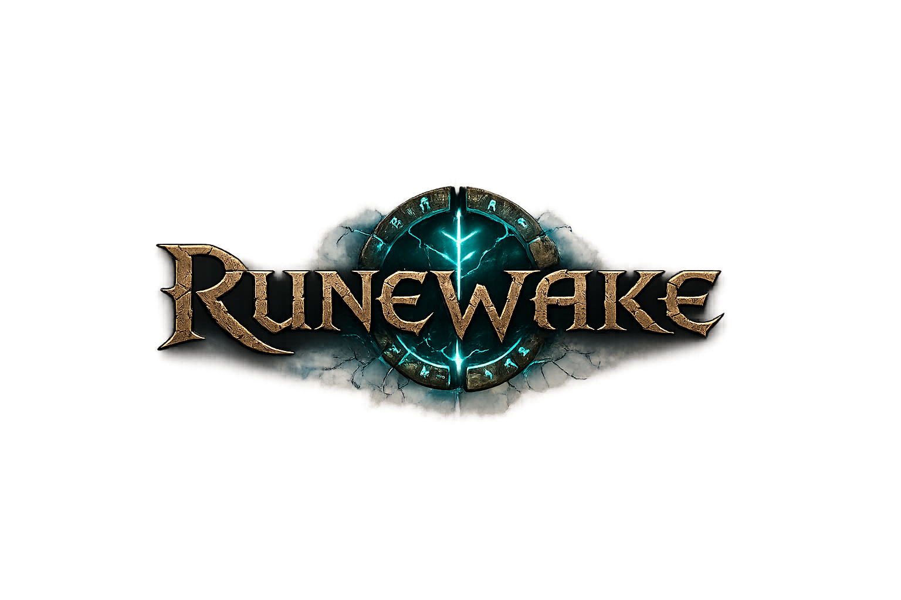

  

# RuneWake

A community-driven revival of RuneScape Classic, built on the
[OpenRSC Core-Framework](https://gitlab.com/open-runescape-classic/core).
RuneWake is free and open source — everything needed to play and to host
your own server lives in this repository, and it always will be a hobby
project: no donations, no pay-to-win, nobody profiting from somebody
else's work.

## Table of contents

1. [About RuneWake](#about)
2. [Playing locally](#play)
3. [Hosting your own server](#hosting)
4. [Downloads](#downloads)
5. [Server browser](#browser)
6. [Minimum requirements](#requirements)
7. [In-game commands](#commands)
8. [Bug reports & community](#community)
9. [License & credits](#credits)

## About RuneWake 

RuneWake continues the work of the OpenRSC project, which made RuneScape
Classic playable again after its closure in August 2018 through
open-source cooperation and black-box reverse engineering. In this
repository you'll find:

- A **faithful, authentic game experience**, verified against thousands of
  hours of RSC+ replays.
- **Optional custom game modes** switchable per-server via configuration
  files — auction house, clans, parties, pets, bank presets, holiday
  events, faster game speeds, higher experience rates, and more — without
  changing any code.
- A rewritten **server framework** that scales far beyond the original
  game, plus a **desktop client** with widescreen/UI-scaling support, a
  modern opt-in theme, and a self-updating launcher.
- A **Windows installer** (`Packaging/`) so players don't need Java
  installed at all.

## Playing locally 

The suggested path is to run the game locally first and learn the
ins and outs before hosting anything public. Platform guides:

- **Windows**: [Windows Getting Started Guide](Windows%20Getting%20Started%20Guide.md)
  — or just double-click `run-client.bat` at the repo root, which builds
  the client and boots a local server for it automatically.
- **Mac**: [MacOS Getting Started Guide](MacOS%20Getting%20Started%20Guide.md)
- **Linux**: [Linux Getting Started Guide](Linux%20Getting%20Started%20Guide.md)

## Hosting your own server 

- **Simplest path (Windows, no Docker)**: double-click `run-server.bat`
  or follow [server/SIMPLE_HOSTING.md](server/SIMPLE_HOSTING.md) — it
  covers port forwarding, making your server reachable from outside your
  network, and listing it publicly.
- **Centralized accounts across multiple worlds**:
  [server/CENTRALIZED_DATABASE.md](server/CENTRALIZED_DATABASE.md)
- **Docker**: `docker-compose.yml` at the repo root provisions a MariaDB
  container; the wiki page
  [Running your own server](https://rsc.vet/wiki/index.php?title=Running_your_own_server)
  covers the traditional setup.
- **Makefile**: database create/import/backup/rank/name-change helpers —
  run `make` and see the target comments for usage.

## Downloads 

The `PC_Launcher` project builds `OpenRSC.jar`, a self-updating launcher
that downloads and keeps the client and its asset cache in sync via MD5
diffing. Published client builds are hosted on this repository's
`game-files` branch; the republish recipe is documented in
[Packaging/README.md](Packaging/README.md). A Windows installer
(`RuneWake-Setup.exe`, bundled JRE, no admin rights required) can be
built from [Packaging/](Packaging/).

## Server browser 

A zero-backend, static [web server browser](web/server-browser/README.md)
shows live player counts and ping for known RuneWake servers by querying
each server's own `/status` endpoint directly — deployed at
<https://theantipopau.github.io/runewake/>. Server operators add their
server via a pull request to `servers.json`; HTTPS status URLs (e.g. via
a free Cloudflare Tunnel) are required for the hosted page — see
[server/SIMPLE_HOSTING.md](server/SIMPLE_HOSTING.md).

## Minimum requirements 

- Windows, MacOS, or Linux
- 2GB RAM to run both server and client, or 1GB for the server alone
- Java Development Kit 8 (JDK 1.8) or newer — preferably OpenJDK. The
  repository bundles a portable JDK + Ant under `Portable_Windows/`, and
  the Windows installer ships its own JRE, so many setups need nothing
  installed at all.

## In-game commands 

See [Commands.md](Commands.md) for in-game command documentation.

## Bug reports & community 

- Bug reports: [GitHub Issues](https://github.com/theantipopau/runewake/issues)
- The upstream OpenRSC project's Discord, Reddit, and website remain the
  hub for the wider community:
  - <a href="https://discord.com/invite/openrsc">Discord</a>
  - <a href="https://www.reddit.com/r/rsc">Reddit</a>
  - <a href="https://rsc.vet">OpenRSC Website</a>

## License & credits 

RuneWake is licensed under the
[GNU Affero General Public License v3](LICENSE).

This project stands on the shoulders of the RSC private-server
development community (2006–2018) and the OpenRSC project and its many
contributors — thank you. RuneWake was originally based on:

- Tooling, reverse engineering, and general concept (2004–2005) by wL and saevion.
- RSCDaemon (2006-2007) by eXemplar, SeanWT, pd, Mediator, and Reines.
- RSCAngel (2007-2010) by Peeter, xEnt, and KO9.
- RSCRevolution (2013-2016) by Fate, Kevin, and n0m.
- RSCLegacy (2016-2018) by Fate and Kevin.

Additional thanks to RSC+, CloudFlare, DigitalOcean, Vultr, JetBrains,
YourKit, Docker, Nginx, MariaDB, OpenJDK, GitLab, GitHub, Ubuntu Linux,
and Rune-Server.ee for supporting the upstream project along the way.
