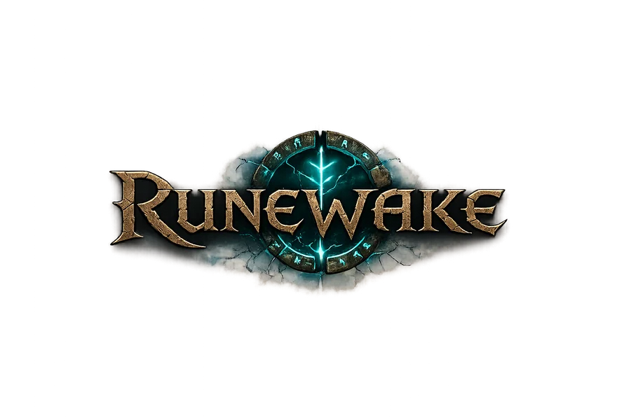

<p align="center">
  <a href="https://theantipopau.github.io/runewake/">
    
  </a>
</p>

<p align="center">
  <strong>Wake the world. Build your legacy.</strong><br>
  <span>An open community revival of RuneScape Classic.</span>
</p>

<p align="center">
  <a href="https://github.com/theantipopau/runewake/actions"></a>
  <a href="LICENSE"></a>
  <a href="https://theantipopau.github.io/runewake/"></a>
  
</p>

# RuneWake

RuneWake is a community-driven revival of [RuneScape
Classic](https://en.wikipedia.org/wiki/RuneScape_Classic), built on the
[OpenRSC Core-Framework](https://gitlab.com/open-runescape-classic/core).
The repository contains the desktop client, server framework, launcher,
packaging tools, configuration examples, static web tools, and the notes that
explain how to run and improve them.

It is a hobby project: **free and open source, no donations, no pay-to-win,
and no profit from somebody else's work**. RuneWake continues the work of
OpenRSC, which made RuneScape Classic playable again after its closure in
August 2018 through open-source cooperation and black-box reverse
engineering.

> **Current visual status:** the client has passed compile and code-level
> checks, but the latest interface changes still need a human visual pass at
> multiple resolutions. The project is explicit about what is verified and
> what is not; see the [visual test matrix](docs/RUNEWAKE_VISUAL_TEST_MATRIX.md).

## Explore RuneWake

- [Open the RuneWake landing page](https://theantipopau.github.io/runewake/)
- [Browse community servers](https://theantipopau.github.io/runewake/server-browser/)
- [Download the latest release](https://github.com/theantipopau/runewake/releases/latest)
- [Open issues and discussions](https://github.com/theantipopau/runewake/issues)
- [Read the project roadmap](ROADMAP.md)
- [Read contribution guidance](CONTRIBUTING.md)

## What is in the box

### A faithful game foundation

- Classic and custom desktop interfaces, with the classic path kept as the
  compatibility baseline.
- Resolution-aware client layout with `uiScale`/`ui()` geometry, paired input
  regions, and a selectable interface-scale cap.
- A minimap with premium bronze/rune-blue chrome, zoom levels, a compass
  plate, and 2× supersampled terrain and wall rendering.
- Optional dark-fantasy premium theme tokens, with classic colours preserved
  when the theme flag is off.
- Desktop Discord Rich Presence, Android client sources, and a launcher that
  keeps published client assets in sync.

### A server platform to configure

- SQLite for a simple local world and MySQL/MariaDB support for centralized
  accounts across multiple worlds.
- Server-side game modes and features including clans, parties, pets, bank
  presets, auctions, holiday events, experience rates, and game-speed options.
- Ant build targets for the server core and plugins, Docker/MariaDB support,
  Makefile helpers, and simple Windows hosting instructions.
- A zero-backend static server browser that asks each server's HTTPS
  `/status` endpoint for live player count and ping.

### A project built to be inspected

- Vendored Java dependencies are documented in
  [`docs/DEPENDENCIES.md`](docs/DEPENDENCIES.md).
- `scripts/check_dependencies.sh` fails verification when a named jar is
  missing; `scripts/check_theme_literals.sh` guards the theme migration.
- Architecture, branding, asset provenance, UI scaling, and visual test notes
  live in [`docs/`](docs/) rather than being hidden in commit messages.
- No commercial RuneScape asset scraping: source-quality RuneWake artwork is
  kept separate from optimised runtime and web copies.

## Start playing

The quickest route on Windows is to double-click `run-client.bat`. The batch
file builds the client and boots a local server for it. Platform-specific
instructions are available here:

- [Windows Getting Started Guide](Windows%20Getting%20Started%20Guide.md)
- [MacOS Getting Started Guide](MacOS%20Getting%20Started%20Guide.md)
- [Linux Getting Started Guide](Linux%20Getting%20Started%20Guide.md)

The bundled `Portable_Windows/` directory contains a portable JDK and Ant for
the Windows scripts. The repository also includes environment examples and
keeps `.env` out of version control.

## Host a world

- **Windows, no Docker:** use [`run-server.bat`](run-server.bat) or follow
  [`server/SIMPLE_HOSTING.md`](server/SIMPLE_HOSTING.md).
- **Centralized accounts:** see
  [`server/CENTRALIZED_DATABASE.md`](server/CENTRALIZED_DATABASE.md).
- **Docker/MariaDB:** use the root `docker-compose.yml`; the upstream
  [Running your own server](https://rsc.vet/wiki/index.php?title=Running_your_own_server)
  guide covers the traditional setup.
- **Database operations:** run `make` to see create/import/backup/rank/name
  helper targets and their comments.

Operators can add a world to the static browser by editing
[`web/server-browser/servers.json`](web/server-browser/servers.json) and
opening a pull request. The status URL must be HTTPS (for example through a
Cloudflare Tunnel), and the default `want_feature_websockets` server mode
serves status on the WebSocket port.

## Downloads and launcher

The first downloadable package is [RuneWake 0.1.0](https://github.com/theantipopau/runewake/releases/tag/v0.1.0). It is a clean player/operator bundle with the built client, launcher, server jars, server data, portable Windows JDK/Ant, and SHA-256 manifest. The release archive is not a source checkout and excludes local databases, logs, secrets, and developer state. See [`docs/RELEASES.md`](docs/RELEASES.md) for the contents, verification steps, and rebuild command.

`PC_Launcher` builds `OpenRSC.jar`, a self-updating launcher that downloads
and maintains the client cache through MD5 diffing. Published client assets
are hosted on the repository's `game-files` branch; the republish procedure is
documented in [`Packaging/README.md`](Packaging/README.md). A Windows
installer can be built from [`Packaging/`](Packaging/) with a bundled JRE and
does not require an administrator install.

## Documentation index

| Area | Start here |
|---|---|
| Project direction | [`ROADMAP.md`](ROADMAP.md) |
| Build and run | [`CONTRIBUTING.md`](CONTRIBUTING.md), [`Commands.md`](Commands.md) |
| Server operations | [`server/SIMPLE_HOSTING.md`](server/SIMPLE_HOSTING.md), [`server/CENTRALIZED_DATABASE.md`](server/CENTRALIZED_DATABASE.md) |
| UI scaling | [`UI_SCALING_PLAN.md`](UI_SCALING_PLAN.md) |
| Architecture and gaps | [`docs/RUNEWAKE_MODERNISATION_AUDIT.md`](docs/RUNEWAKE_MODERNISATION_AUDIT.md) |
| Branding and identity | [`docs/RUNEWAKE_BRANDING_AUDIT.md`](docs/RUNEWAKE_BRANDING_AUDIT.md) |
| Artwork provenance | [`docs/RUNEWAKE_ASSET_INVENTORY.md`](docs/RUNEWAKE_ASSET_INVENTORY.md) |
| Visual verification | [`docs/RUNEWAKE_VISUAL_TEST_MATRIX.md`](docs/RUNEWAKE_VISUAL_TEST_MATRIX.md) |
| Java libraries | [`docs/DEPENDENCIES.md`](docs/DEPENDENCIES.md) |
| Static server browser | [`web/server-browser/README.md`](web/server-browser/README.md) |
| GitHub Pages layout | [`web/site/README.md`](web/site/README.md), [`docs/FREE_HOSTING.md`](docs/FREE_HOSTING.md) |
| Releases | [`docs/RELEASES.md`](docs/RELEASES.md) |
| Security | [`SECURITY.md`](SECURITY.md) |

## Minimum requirements

- Windows, macOS, or Linux.
- 2 GB RAM to run both the server and client, or 1 GB for the server alone.
- Java Development Kit 8 (JDK 1.8) or newer, preferably OpenJDK. The
  repository's portable Windows tools and installer can provide the runtime
  without a separate system installation.

## Development checks

From the repository root, the lightweight project checks are:

```sh
bash scripts/check_dependencies.sh
bash scripts/check_theme_literals.sh
```

The CI pipeline runs both checks before compiling the server core, server
plugins, client, and launcher. Build outputs and the exact verification
matrix are recorded in the [visual test matrix](docs/RUNEWAKE_VISUAL_TEST_MATRIX.md)
and [modernisation audit](docs/RUNEWAKE_MODERNISATION_AUDIT.md).

## Community

- [GitHub issues](https://github.com/theantipopau/runewake/issues)
- [OpenRSC Discord](https://discord.com/invite/openrsc)
- [RuneScape Classic Reddit](https://www.reddit.com/r/rsc)
- [OpenRSC website](https://rsc.vet)

Please read [`CONTRIBUTING.md`](CONTRIBUTING.md) before sending a change, and
keep third-party artwork and dependency provenance documented.

## License and historical credits

RuneWake is licensed under the [GNU Affero General Public License v3](LICENSE).

This project stands on the shoulders of the RSC private-server development
community (2006–2018), the OpenRSC project, and its many contributors. The
RuneWake identity is the current project identity; the following historical
foundations are intentionally preserved as attribution rather than rewritten:

- Tooling, reverse engineering, and general concept (2004–2005) by **wL** and
  **saevion**.
- **RSCDaemon** (2006–2007) by **eXemplar**, **SeanWT**, **pd**, **Mediator**,
  and **Reines**.
- **RSCAngel** (2007–2010) by **Peeter**, **xEnt**, and **KO9**.
- **RSCRevolution** (2013–2016) by **Fate**, **Kevin**, and **n0m**.
- **RSCLegacy** (2016–2018) by **Fate** and **Kevin**.

Additional thanks to RSC+, Cloudflare, DigitalOcean, Vultr, JetBrains,
YourKit, Docker, Nginx, MariaDB, OpenJDK, GitLab, GitHub, Ubuntu Linux, and
Rune-Server.ee for supporting the upstream project along the way.
